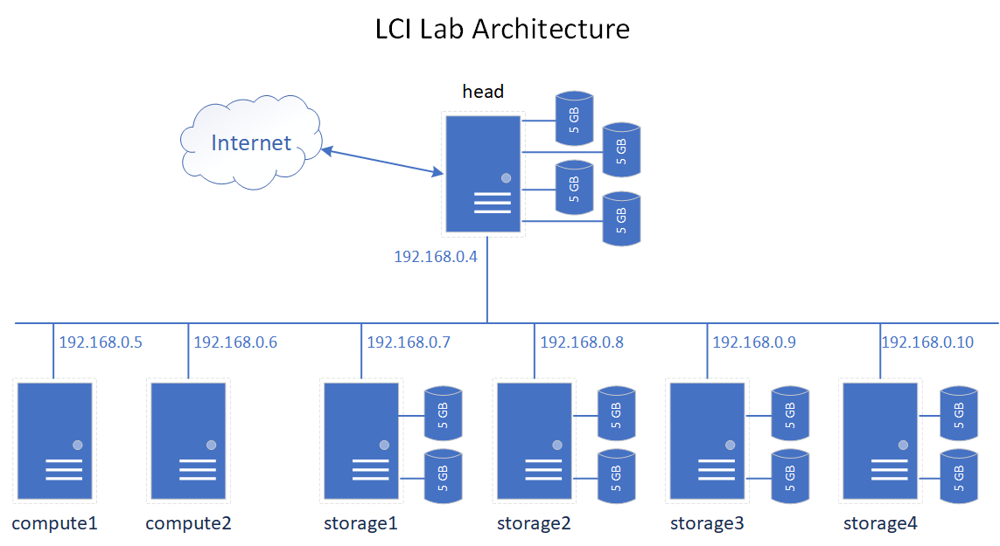
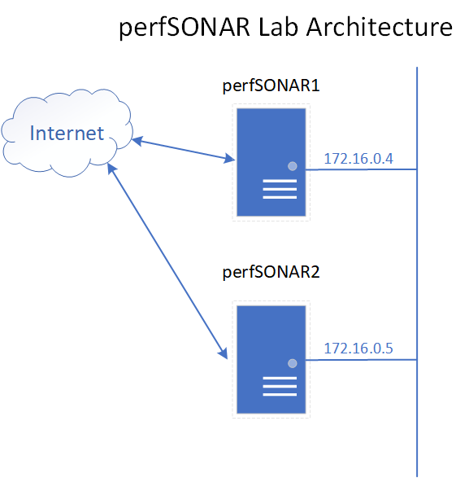

# LCI Workshop
This link will deploy a login (head) node, two compute nodes, and 4 storage nodes for use in the hands-on labs for the LCI Workshop.

This link will deploy two (CentOS 7) nodes for running the perfSONAR labs.  These nodes will both have Public IP addresses for enabling connections directly from the internet.

